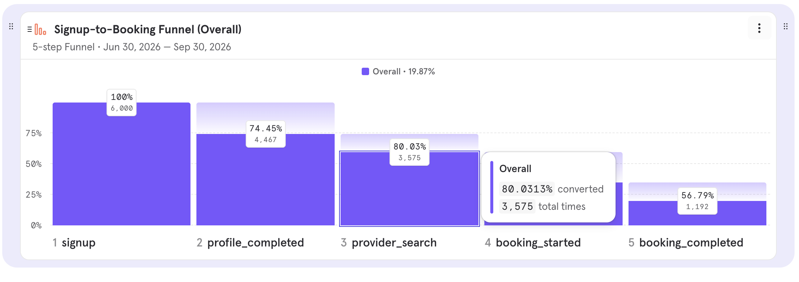
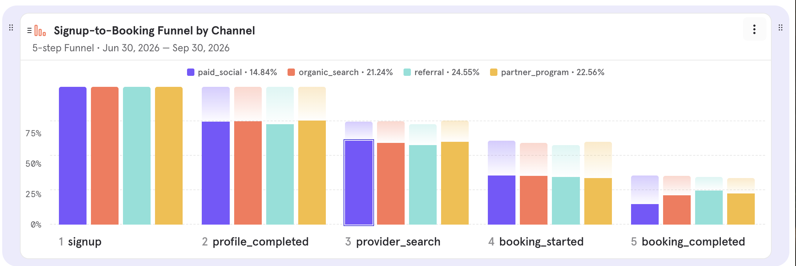
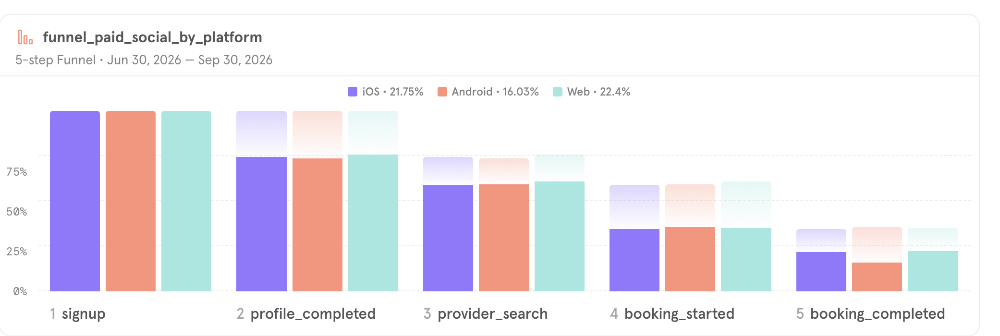
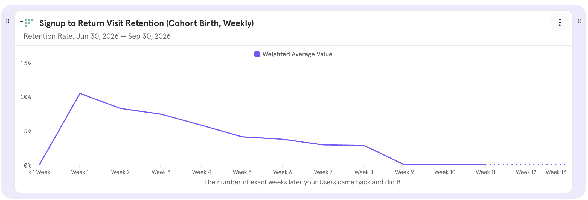

# Booking App Engagement Analytics (Simulated Data)

A product-analytics portfolio project: I generated event data for a **fictional appointment-booking app**, loaded it into **Mixpanel**, and used funnel and retention analysis to find where users drop off.

> **All data in this repo is simulated.** There are no real users and no health or personal information. The generator deliberately builds in three patterns, so the point of this project is the **analysis workflow and how I reason about the results**, not the findings themselves.

## What this project shows

- Defining a funnel and event schema for a booking product
- Generating a reproducible event dataset (Python) and importing it into Mixpanel via the `/import` API
- Funnel analysis by acquisition channel and by platform, and checking whether the two effects are confounded
- Cohort retention by signup week, and handling incomplete (right-censored) cohorts
- Writing up findings with caveats and hypotheses rather than overstating them

## Data

| | |
|---|---|
| Users | 6,000 (simulated) |
| Events | 20,289 |
| Period | Jun 30 - Sep 30, 2026 (Mixpanel project timezone: US/Pacific; the generator uses UTC) |
| Events | `signup`, `profile_completed`, `provider_search`, `booking_started`, `booking_completed`, `session_attended`, `return_visit` |
| Properties | `platform` (iOS, Android, Web), `acquisition_channel` (organic_search, paid_social, referral, partner_program), `plan_type` |

## Findings

### 1. Overall funnel



| Step | Users | Step conversion |
|---|---|---|
| signup | 6,000 | |
| profile_completed | 4,467 | 74.45% |
| provider_search | 3,575 | 80.03% |
| booking_started | 2,099 | 58.71% |
| booking_completed | 1,192 | 56.79% |

Overall signup-to-booking conversion is **19.87%**. The biggest drop is between `provider_search` and `booking_started`, and about 43% of users who start a booking do not complete it.

### 2. paid_social converts worst at the last step



| Channel | Signups | Overall conversion | booking_started to booking_completed |
|---|---|---|---|
| paid_social | 2,102 | 14.84% | 41.82% (312 / 746) |
| organic_search | 1,813 | 21.24% | 60.25% (385 / 639) |
| partner_program | 851 | 22.56% | 66.9% (192 / 287) |
| referral | 1,234 | 24.55% | 70.96% (303 / 427) |

paid_social brings the most signups but the lowest completion. The earlier steps look similar across channels, so the gap is concentrated in the final step.

### 3. Android is weaker, and it is a separate issue from channel

Overall conversion by platform: iOS 21.75%, Android 16.03%, Web 22.4%.

To check whether "paid_social is bad" was really "paid_social has a lot of Android users", I filtered to paid_social users and split by platform:



| Platform (paid_social only) | Signups | Overall conversion | booking_started to booking_completed |
|---|---|---|---|
| iOS | 848 | 17.22% | 49.32% (146 / 296) |
| Android | 738 | 11.11% | 30.6% (82 / 268) |
| Web | 516 | 16.28% | 46.15% (84 / 182) |

Android is lower even inside the same channel, and paid_social iOS users (49.32%) are below iOS users overall (63.18%). So channel and platform look like **two separate effects** that stack, and paid_social on Android is the weakest combination.

### 4. One signup cohort retains about half as well



| Signup week | Users | Week 1 | Week 2 | Week 3 |
|---|---|---|---|---|
| Aug 3 | 495 | 11.31% | 8.48% | 9.7% |
| **Aug 10** | **458** | **4.59%** | **3.71%** | **2.18%** |
| Aug 17 | 464 | 10.13% | 8.41% | 7.97% |

Users who signed up in the week of Aug 10 return far less than the weeks around them, across every week observed, while cohort size is similar. Retention here uses all signups as the denominator.

### 5. Significance tests

Two-sided z-tests for two proportions (`two_proportion_ztest` in `analysis.py`, covered by unit tests):

| Comparison | Group A | Group B | Difference | z | p-value |
|---|---|---|---|---|---|
| Last step: paid_social vs other channels | 41.8% (312/746) | 65.0% (880/1,353) | -23.2 pts | -10.28 | 8.9e-25 |
| Last step inside paid_social: Android vs iOS+Web | 30.6% (82/268) | 48.1% (230/478) | -17.5 pts | -4.65 | 3.2e-06 |
| Week-1 return: Aug 10 cohort vs Aug 3 + Aug 17 cohorts | 4.6% (21/458) | 10.7% (103/959) | -6.2 pts | -3.83 | 1.3e-04 |

All three differences are far beyond what chance would produce, and they still pass a conservative Bonferroni threshold (0.05 / 3 tests). Because the patterns were designed into the simulated data, the p-values mainly confirm that the generator and my analysis agree. With real data they would be evidence, not proof.

The retention counts (21, 103) are reconstructed from the percentages shown in Mixpanel, so they are approximate.
## Caveats

- **Simulated data.** The three patterns were designed in, so these results show the method, not a real discovery.
- **Small samples in the splits.** Some cells have only 180-300 users. The tests above use the normal approximation, which is reasonable at these counts, but results from small splits should still be treated as directional. Users are assumed independent, and pooling the three other channels into one group hides differences between them.
- **Incomplete cohorts.** Mixpanel marks recent cohorts with `*` because later weeks have not happened yet. Those cells are not comparable, and I excluded them from the comparison. The last cohort (week of Sep 28) is also a partial week.
- **Synthetic return visits.** The generator creates return visits in weekly steps, so the daily retention curve is spiky. That is an artifact of the generator, not user behavior.

## What I would do with real data

Possible explanations for each pattern, to check rather than assume:

- **Android last-step drop:** a checkout or payment-form problem on Android. Compare error events, app version, and device mix.
- **paid_social last-step drop:** weaker purchase intent from that audience, or a mismatch between ad promise and booking flow. Look at campaign and creative, and test a landing-page or onboarding change.
- **Aug 10 cohort:** a release or onboarding change that week. Check release logs, and the channel and platform mix of that cohort.

## Repo contents

| File | Purpose |
|---|---|
| `generate_sim_data.py` | Generates `events.csv`, `users.csv`, `events.jsonl` (seeded, reproducible) |
| `import_to_mixpanel.py` | One-off import of `events.jsonl` via Mixpanel's `/import` API (credentials from environment variables) |
| `events.csv`, `users.csv` | Generated data |
| `screenshots/` | Mixpanel reports used above |
| `requirements.txt` | Python dependencies |
| `analysis.py` | Reusable functions: data validation, funnel, last-step by group, retention by signup week, z-test |
| `tests/test_analysis.py` | pytest unit tests, including a check that the funnel matches the Mixpanel numbers |
| `pytest.ini` | pytest configuration |

## Reproduce

```bash
python3 -m venv .venv && source .venv/bin/activate
pip install -r requirements.txt
python generate_sim_data.py
pytest   # runs the unit tests

# optional: import into your own Mixpanel project
export MIXPANEL_PROJECT_TOKEN="..."   # never commit credentials
python import_to_mixpanel.py --dry-run
python import_to_mixpanel.py
```

## Next steps

- Build a Looker Studio dashboard on the same data (BigQuery or Google Sheets)
- Add confidence intervals and a multiple-comparison correction to the tests
- Turn the funnel and retention views into a small Streamlit app

## Process note

I used an AI assistant to help draft the data generator and import scripts. I did the analysis in Mixpanel, interpreted the results, and wrote this report.
